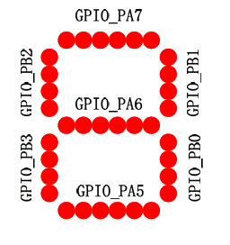
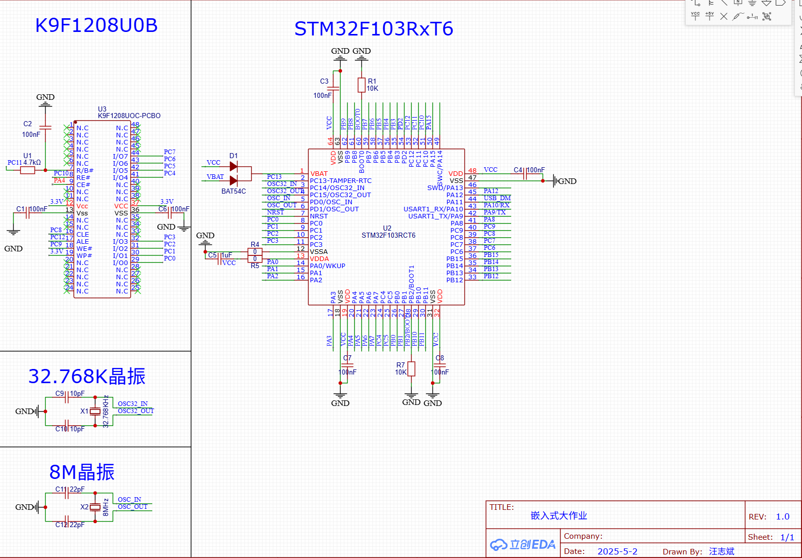
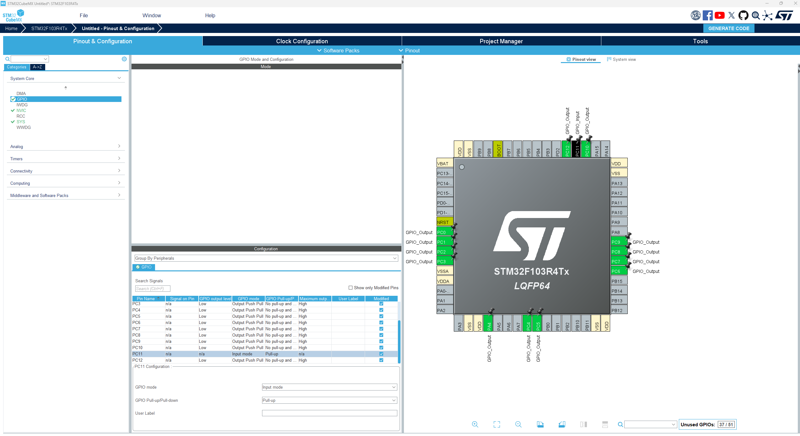

# 嵌入式系统原理与设计大作业    电信221 汪志斌
# 一、程序改错（20分）                                  
    以下I2C存储器通信程序有4处错误，每处5分，共20分。 
    请使用：“程序第X行改为：……”来进行回答。 
    注：存储器的设备地址为0x50，读取数据的起始地址为0x0400。 
```
1  HAL_StatusTypeDef  Read_Mem_I2C(uint16_t *data, uint8_t length){ 
2      HAL_StatusTypeDef  status = HAL_ERROR; 
3      uint8_t temp;
4      for (int i = 0; i <length; i++){            
5           status = HAL_I2C_Mem_Read(&hi2c2, 0x50, 0x0400, I2C_MEMADD_SIZE_16BIT, temp, 2,100); 
6           if (status == HAL_OK) return status; 
7           data[i] = (temp >>8) | temp;
8      }
9      return status;
10 } 
```
## 答:
1. 程序第3行改为：```uint8_t temp[2];```
2. 程序第5行改为：```status = HAL_I2C_Mem_Read(&hi2c2, 0xA1, 0x0400+i*2, I2C_MEMADD_SIZE_16BIT, temp, 2,100); ```
3. 程序第6行改为：```if (status != HAL_OK) return status; ```
4. 程序第7行改为：```data[i] = (temp[0] <<8) | temp[1];```

---

# 二、程序设计
    请编写嵌入式控制程序来实现以下功能： 
    利用下图所示的LED灯阵实现每秒倒计时计数。对应的控制管脚如图标注。 
&emsp;&nbsp;
## 答:
```
#include "stm32f1xx_hal.h"

// 宏定义七段引脚
#define SEG_A_PIN     GPIO_PIN_7   // PA7
#define SEG_B_PIN     GPIO_PIN_2   // PB2
#define SEG_C_PIN     GPIO_PIN_6   // PA6
#define SEG_D_PIN     GPIO_PIN_1   // PB1
#define SEG_E_PIN     GPIO_PIN_3   // PB3
#define SEG_F_PIN     GPIO_PIN_5   // PA5
#define SEG_G_PIN     GPIO_PIN_0   // PB0

// 共阴极七段码（0-9）
const uint8_t seg_code[10] = {
    0x3F, // 0
    0x06, // 1
    0x5B, // 2
    0x4F, // 3
    0x66, // 4
    0x6D, // 5
    0x7D, // 6
    0x07, // 7
    0x7F, // 8
    0x6F  // 9
};

void SystemClock_Config(void);
void GPIO_Init(void);

int main(void) {
    HAL_Init();
    SystemClock_Config();
    GPIO_Init();

    uint8_t counter = 9;
    
    while(1) {
        // 更新显示
        HAL_GPIO_WritePin(GPIOA, SEG_A_PIN, (seg_code[counter] & 0x01) ? GPIO_PIN_SET : GPIO_PIN_RESET);
        HAL_GPIO_WritePin(GPIOB, SEG_B_PIN, (seg_code[counter] & 0x02) ? GPIO_PIN_SET : GPIO_PIN_RESET);
        HAL_GPIO_WritePin(GPIOA, SEG_C_PIN, (seg_code[counter] & 0x04) ? GPIO_PIN_SET : GPIO_PIN_RESET);
        HAL_GPIO_WritePin(GPIOB, SEG_D_PIN, (seg_code[counter] & 0x08) ? GPIO_PIN_SET : GPIO_PIN_RESET);
        HAL_GPIO_WritePin(GPIOB, SEG_E_PIN, (seg_code[counter] & 0x10) ? GPIO_PIN_SET : GPIO_PIN_RESET);
        HAL_GPIO_WritePin(GPIOA, SEG_F_PIN, (seg_code[counter] & 0x20) ? GPIO_PIN_SET : GPIO_PIN_RESET);
        HAL_GPIO_WritePin(GPIOB, SEG_G_PIN, (seg_code[counter] & 0x40) ? GPIO_PIN_SET : GPIO_PIN_RESET);

        HAL_Delay(1000);
        counter = (counter == 0) ? 9 : (counter - 1);
    }
}

/* GPIO初始化 */
void GPIO_Init(void) {
    GPIO_InitTypeDef GPIO_InitStruct = {0};
    
    __HAL_RCC_GPIOA_CLK_ENABLE();
    __HAL_RCC_GPIOB_CLK_ENABLE();

    // 配置所有段为推挽输出模式
    GPIO_InitStruct.Mode = GPIO_MODE_OUTPUT_PP;
    GPIO_InitStruct.Pull = GPIO_NOPULL;
    GPIO_InitStruct.Speed = GPIO_SPEED_FREQ_HIGH;
    
    // 配置PA管脚
    GPIO_InitStruct.Pin = SEG_A_PIN | SEG_C_PIN | SEG_F_PIN;
    HAL_GPIO_Init(GPIOA, &GPIO_InitStruct);
    
    // 配置PB管脚
    GPIO_InitStruct.Pin = SEG_B_PIN | SEG_D_PIN | SEG_E_PIN | SEG_G_PIN;
    HAL_GPIO_Init(GPIOB, &GPIO_InitStruct);
}

/* 系统时钟配置（72MHz） */
void SystemClock_Config(void) {
    RCC_OscInitTypeDef RCC_OscInitStruct = {0};
    RCC_ClkInitTypeDef RCC_ClkInitStruct = {0};
    
    // 配置主PLL
    RCC_OscInitStruct.OscillatorType = RCC_OSCILLATORTYPE_HSE;
    RCC_OscInitStruct.HSEState = RCC_HSE_ON;
    RCC_OscInitStruct.HSEPredivValue = RCC_HSE_PREDIV_DIV1;
    RCC_OscInitStruct.PLL.PLLState = RCC_PLL_ON;
    RCC_OscInitStruct.PLL.PLLSource = RCC_PLLSOURCE_HSE;
    RCC_OscInitStruct.PLL.PLLMUL = RCC_PLL_MUL9;
    HAL_RCC_OscConfig(&RCC_OscInitStruct);
    
    // 配置系统时钟
    RCC_ClkInitStruct.ClockType = RCC_CLOCKTYPE_HCLK|RCC_CLOCKTYPE_SYSCLK
                                |RCC_CLOCKTYPE_PCLK1|RCC_CLOCKTYPE_PCLK2;
    RCC_ClkInitStruct.SYSCLKSource = RCC_SYSCLKSOURCE_PLLCLK;
    RCC_ClkInitStruct.AHBCLKDivider = RCC_SYSCLK_DIV1;
    RCC_ClkInitStruct.APB1CLKDivider = RCC_HCLK_DIV2;
    RCC_ClkInitStruct.APB2CLKDivider = RCC_HCLK_DIV1;
    HAL_RCC_ClockConfig(&RCC_ClkInitStruct, FLASH_LATENCY_2);
}
```

---
# 三、嵌入式存储器电路设计
    请完成STM32F103R4T6ATR与K9F1208U0B的电路连接。
    （1）画出电路连接原理示意图（5分）； 
    （2）在STM32CubeMX中完成相应的管脚配置，贴截图（5分）； 
    （3）写出访问存储器的读写函数（15分）。

## 答:该32无法用硬件FSMC，只能采用GPIO 软驱动（模拟 FSMC）方案
（1） 电路连接原理示意图

（2） STM32CubeMX中完成相应的管脚配置

（3） 
```
// 写命令示例
v#include "stm32f1xx_hal.h"

/*—— 1. 引脚宏 ——*/
#define NAND_CE_L()   HAL_GPIO_WritePin(GPIOA, GPIO_PIN_4, GPIO_PIN_RESET)
#define NAND_CE_H()   HAL_GPIO_WritePin(GPIOA, GPIO_PIN_4, GPIO_PIN_SET)

#define CLE_HIGH()    HAL_GPIO_WritePin(GPIOC, GPIO_PIN_8, GPIO_PIN_SET)
#define CLE_LOW()     HAL_GPIO_WritePin(GPIOC, GPIO_PIN_8, GPIO_PIN_RESET)
#define ALE_HIGH()    HAL_GPIO_WritePin(GPIOC, GPIO_PIN_12, GPIO_PIN_SET)
#define ALE_LOW()     HAL_GPIO_WritePin(GPIOC, GPIO_PIN_12, GPIO_PIN_RESET)

#define WE_ACTIVE()   HAL_GPIO_WritePin(GPIOC, GPIO_PIN_9, GPIO_PIN_RESET)
#define WE_IDLE()     HAL_GPIO_WritePin(GPIOC, GPIO_PIN_9, GPIO_PIN_SET)
#define RE_ACTIVE()   HAL_GPIO_WritePin(GPIOC, GPIO_PIN_10,GPIO_PIN_RESET)
#define RE_IDLE()     HAL_GPIO_WritePin(GPIOC, GPIO_PIN_10,GPIO_PIN_SET)

#define RNB_PIN       GPIO_PIN_11
#define RNB_PORT      GPIOC

/*—— 2. 数据总线方向切换 ——*/
static void DataBus_Output(void) {
    GPIO_InitTypeDef gp = {0};
    gp.Pin   = GPIO_PIN_0|GPIO_PIN_1|GPIO_PIN_2|GPIO_PIN_3
             | GPIO_PIN_4|GPIO_PIN_5|GPIO_PIN_6|GPIO_PIN_7;
    gp.Mode  = GPIO_MODE_OUTPUT_PP;
    gp.Speed = GPIO_SPEED_FREQ_HIGH;
    gp.Pull  = GPIO_NOPULL;
    HAL_GPIO_Init(GPIOC, &gp);
}
static void DataBus_Input(void) {
    GPIO_InitTypeDef gp = {0};
    gp.Pin  = GPIO_PIN_0|GPIO_PIN_1|GPIO_PIN_2|GPIO_PIN_3
            |GPIO_PIN_4|GPIO_PIN_5|GPIO_PIN_6|GPIO_PIN_7;
    gp.Mode = GPIO_MODE_INPUT;
    gp.Pull = GPIO_NOPULL;
    HAL_GPIO_Init(GPIOC, &gp);
}

/*—— 3. 低级命令/地址/数据/等待 ——*/
static inline void NAND_WaitReady(void) {
    while(HAL_GPIO_ReadPin(RNB_PORT, RNB_PIN) == GPIO_PIN_RESET);
}

static void NAND_SendCmd(uint8_t cmd)
{
    DataBus_Output();
    CLE_HIGH();  ALE_LOW();
    /* 写入命令到 PC0~PC7 */
    for(uint8_t i=0; i<8; i++){
        HAL_GPIO_WritePin(GPIOC, (1<<i),
            (cmd & (1<<i)) ? GPIO_PIN_SET : GPIO_PIN_RESET);
    }
    /* WE 下拉一个时钟 */
    WE_ACTIVE();
    WE_IDLE();
    CLE_LOW();
}

static void NAND_SendAddr(uint8_t addr)
{
    DataBus_Output();
    ALE_HIGH();  CLE_LOW();
    for(uint8_t i=0; i<8; i++){
        HAL_GPIO_WritePin(GPIOC, (1<<i),
            (addr & (1<<i)) ? GPIO_PIN_SET : GPIO_PIN_RESET);
    }
    WE_ACTIVE();
    WE_IDLE();
    ALE_LOW();
}

static uint8_t NAND_ReadData(void)
{
    uint8_t d = 0;
    DataBus_Input();
    RE_ACTIVE();
    /* 把 PC0~PC7 电平读到 d */
    for(uint8_t i=0; i<8; i++){
        if(HAL_GPIO_ReadPin(GPIOC, (1<<i)) == GPIO_PIN_SET) {
            d |= (1<<i);
        }
    }
    RE_IDLE();
    return d;
}

static void NAND_WriteData(uint8_t d)
{
    DataBus_Output();
    for(uint8_t i=0; i<8; i++){
        HAL_GPIO_WritePin(GPIOC, (1<<i),
            (d & (1<<i)) ? GPIO_PIN_SET : GPIO_PIN_RESET);
    }
    WE_ACTIVE();
    WE_IDLE();
}

/*—— 4. NAND 读/写/擦除 单页、单块 ——*/
#define NAND_CMD_READ1       0x00
#define NAND_CMD_READ2       0x30
#define NAND_CMD_WRITE1      0x80
#define NAND_CMD_WRITE2      0x10
#define NAND_CMD_ERASE1      0x60
#define NAND_CMD_ERASE2      0xD0
#define NAND_CMD_STATUS      0x70
#define NAND_CMD_READ_ID     0x90

#define NAND_PAGE_SIZE       2048U
#define NAND_SPARE_SIZE      64U
#define NAND_PAGES_PER_BLOCK 64U

static void NAND_ReadPage(uint32_t page, uint8_t *buf)
{
    NAND_CE_L();
    NAND_SendCmd(NAND_CMD_READ1);
    NAND_SendAddr(0x00);
    NAND_SendAddr(0x00);
    NAND_SendAddr((page      ) & 0xFF);
    NAND_SendAddr((page >>  8) & 0xFF);
    NAND_SendAddr((page >> 16) & 0xFF);
    NAND_SendCmd(NAND_CMD_READ2);
    NAND_WaitReady();
    for(uint32_t i=0; i<NAND_PAGE_SIZE+NAND_SPARE_SIZE; i++){
        buf[i] = NAND_ReadData();
    }
    NAND_CE_H();
}

static void NAND_WritePage(uint32_t page, const uint8_t *buf)
{
    NAND_CE_L();
    NAND_SendCmd(NAND_CMD_WRITE1);
    NAND_SendAddr(0x00);
    NAND_SendAddr(0x00);
    NAND_SendAddr((page      ) & 0xFF);
    NAND_SendAddr((page >>  8) & 0xFF);
    NAND_SendAddr((page >> 16) & 0xFF);
    for(uint32_t i=0; i<NAND_PAGE_SIZE+NAND_SPARE_SIZE; i++){
        NAND_WriteData(buf[i]);
    }
    NAND_SendCmd(NAND_CMD_WRITE2);
    NAND_WaitReady();
    NAND_CE_H();
}

static HAL_StatusTypeDef NAND_EraseBlock(uint32_t block)
{
    uint32_t first = block * NAND_PAGES_PER_BLOCK;
    NAND_CE_L();
    NAND_SendCmd(NAND_CMD_ERASE1);
    NAND_SendAddr((first      ) & 0xFF);
    NAND_SendAddr((first >>   8) & 0xFF);
    NAND_SendAddr((first >>  16) & 0xFF);
    NAND_SendCmd(NAND_CMD_ERASE2);
    NAND_WaitReady();
    NAND_SendCmd(NAND_CMD_STATUS);
    uint8_t st = NAND_ReadData();
    NAND_CE_H();
    return (st & 0x01) ? HAL_ERROR : HAL_OK;
}

/*—— 5. 线性读写：自动跨页 + 可选擦除 ——*/
#define MIN(a,b)  (((a)<(b))?(a):(b))
#define PAGE_SZ   (NAND_PAGE_SIZE)
#define BLOCK_SZ  (NAND_PAGE_SIZE * NAND_PAGES_PER_BLOCK)

void NAND_Read(uint32_t addr, uint8_t *buf, uint32_t len)
{
    uint32_t page =  addr / PAGE_SZ;
    uint16_t col  =  addr % PAGE_SZ;
    uint32_t cnt;

    while(len){
        cnt = MIN(len, PAGE_SZ - col);
        /* 读整页到临时缓存，再 memcpy？也可直接分批读： */
        NAND_CE_L();
        NAND_SendCmd(NAND_CMD_READ1);
        NAND_SendAddr(col & 0xFF);
        NAND_SendAddr((col>>8)&0xFF);
        NAND_SendAddr((page      ) & 0xFF);
        NAND_SendAddr((page >> 8 ) & 0xFF);
        NAND_SendAddr((page >>16 ) & 0xFF);
        NAND_SendCmd(NAND_CMD_READ2);
        NAND_WaitReady();
        for(uint32_t i=0;i<cnt;i++){
            buf[i] = NAND_ReadData();
        }
        NAND_CE_H();

        len  -= cnt;
        buf  += cnt;
        page ++;
        col   = 0;
    }
}

void NAND_Write(uint32_t addr, const uint8_t *buf, uint32_t len)
{
    uint32_t page =  addr / PAGE_SZ;
    uint16_t col  =  addr % PAGE_SZ;
    uint32_t cnt;

    while(len){
        /* 必要时擦除块 */
        if(col == 0){
            uint32_t blk = page / NAND_PAGES_PER_BLOCK;
            NAND_EraseBlock(blk);
        }
        cnt = MIN(len, PAGE_SZ - col);
        /* 分批写入 */
        NAND_CE_L();
        NAND_SendCmd(NAND_CMD_WRITE1);
        NAND_SendAddr(col & 0xFF);
        NAND_SendAddr((col>>8)&0xFF);
        NAND_SendAddr((page      ) & 0xFF);
        NAND_SendAddr((page >> 8 ) & 0xFF);
        NAND_SendAddr((page >>16 ) & 0xFF);
        for(uint32_t i=0;i<cnt;i++){
            NAND_WriteData(buf[i]);
        }
        NAND_SendCmd(NAND_CMD_WRITE2);
        NAND_WaitReady();
        NAND_CE_H();

        len  -= cnt;
        buf  += cnt;
        page ++;
        col   = 0;
    }
}

```


---

# 四、嵌入式系统总体设计
    针对用户需求，设计有效的嵌入式系统：
    用户需要在数字航标上加设一个嵌入式设备以完成对水下光通信的存储与转发。 
    该设备安装在水下平台上，该水下平台通过一根空心钢管与漂浮在水面的数字航标进
    行物理连接。数字航标上有一个通用计算机，具备 USB、以太网等常见的数据端口。配
    套的光信号接收装置具有采集水下光信号的强度（每符号光能量），具备模数转换能力，
    并通过I2C总线进行数字化传输。 
    要设计的嵌入式系统应当具备以下能力：①将采集到的数字化的光强信息传输至浮标
    计算机；②将浮标计算机给出的接收机配置信息（如采样频率、接收符号的持续时间等）
    转发给信号接收机；③具备一定的数据缓存能力。 
        根据上述材料，完成以下任务： 
    （1）写出总体设计报告的大纲（5分）； 
    （2）完成用户需求分析（10分）； 
    （3）给出硬件平台选型建议，包括 MCU 型号选择、存储器层级设计、存储空间分
    配、其他必要配套外设等，并解释理由（10分）； 
    （4）指出本系统的特别注意事项（5分）。

## 答:
### （1）写出总体设计报告大纲：

1. **引言**
   1.1 背景及意义
   1.2 设计目标与范围

2. **需求分析**
   2.1 功能需求

   * 光强数据采集与上行转发
   * 配置指令下行转发
   * 本地缓存与管理
     2.2 性能指标
   * 实时性要求（最大传输时延、采样频率范围）
   * 缓存容量与读写速率
     2.3 界面与协议需求
   * I2C 与光接收机交互
   * USB/Ethernet 与浮标计算机交互
     2.4 环境与可靠性要求
   * 耐压、防水、防腐蚀
   * 温度、振动适应性

3. **系统总体架构**
   3.1 系统结构框图
   3.2 模块划分

   * 主控单元
   * 接口单元（I2C、USB/Ethernet）
   * 存储单元
     3.3 数据流与控制流

4. **硬件设计**
   4.1 主控板方案（MCU/SoC 选型）
   4.2 接口电路设计

   * I2C 总线电平转换与隔离
   * USB/Ethernet PHY 与保护
     4.3 存储子系统
   * 缓存类型（SD 卡、eMMC、FLASH）
   * 存储容量估算
     4.4 电源与防护设计
   * 电源模块选型与滤波
   * 防水、防腐蚀及接地方案

5. **软件设计**
   5.1 软件架构

   * 驱动层（I2C、USB/Ethernet、存储）
   * 中间件层（协议封装、缓存管理）
   * 应用层（数据采集、转发控制）
     5.2 I2C 通信驱动与协议栈
     5.3 上行通信协议设计（数据打包、校验）
     5.4 缓存管理策略（环形缓存、溢出处理）
     5.5 配置下发与确认机制

6. **系统集成与验证**
   6.1 硬件集成测试
   6.2 软件功能测试
   6.3 接口连通性测试
   6.4 性能测试（时延、带宽、缓存吞吐）
   6.5 环境适应性测试

7. **风险分析与对策**
   7.1 潜在风险识别（链路中断、电磁干扰、存储失效等）
   7.2 缓解措施

8. **项目计划与成本估算**
   8.1 研发进度计划
   8.2 物料清单与预算


### （2）用户需求分析：
**1. 功能需求**  
① 光强信息采集与传输  
• 实时采集：  
  • 通过I2C总线以不低于1kHz的采样频率读取光信号接收机的数字化光强数据（每符号光能量）。  
  • 支持动态调整采样频率（范围：100Hz~10kHz），由浮标计算机下发指令控制。  
• 数据传输：  
  • 使用以太网（优先级）或USB 2.0接口，将数据实时上传至浮标计算机，传输延迟≤100ms。  
  • 数据格式标准化：包含时间戳（UTC时间）、光强值（12位ADC精度）、设备ID等信息。  
  • 支持断网续传：在网络中断时，本地缓存至少24小时数据（按1kHz采样率计算需存储约864万条数据）。  

② 接收机配置管理  
• 参数下发：  
  • 接收浮标计算机的配置指令，包括：  
    ◦ 采样频率（单位：Hz）、符号持续时间（单位：μs）、ADC增益（如1x/10x/100x）。  
  • 配置指令需支持批量更新与单参数修改（如仅调整采样频率）。  

• 配置验证：  
  • 通过I2C总线将配置写入光信号接收机后，需读取接收机状态寄存器，返回“配置成功”或错误码（如超时、无效参数）。  
  • 异常处理：若配置失败，自动回退至上一次有效配置，并向浮标计算机发送告警。  

③ 数据缓存与容灾  
• 多级缓存设计：  
  • 一级缓存：MCU片内SRAM（≥256KB），存储最近5分钟数据，支持实时访问。  
  • 二级缓存：外部eMMC或MicroSD卡（≥8GB），存储历史数据，支持循环覆盖写入。  
• 缓存触发条件：  
  • 网络延迟＞200ms时，自动启用二级缓存；网络恢复后优先上传缓存数据。  
  • 存储空间剩余＜10%时，向浮标计算机发送存储预警。  

**2. 非功能需求**  
① 环境适应性  
• 防水与耐压：  
  • 满足IP68防护等级，支持水深≥50米（抗压≥5Bar），外壳材料选用316L不锈钢或钛合金。  
  • 接口密封：USB/以太网接口采用灌胶密封，I2C总线通过压力平衡防水连接器接入。  
• 抗干扰能力：  
  • 光信号接收机与嵌入式设备间的I2C总线需在10米距离内稳定传输，误码率＜1e-6。  
  • 系统需通过EMC测试（如IEC 61000-4系列标准），抵抗水下电磁干扰。  

② 实时性与可靠性  
• 关键指标：  
  • 数据采集周期抖动＜1μs，确保时间戳精度。  
  • 配置指令响应时间＜50ms（从接收到指令至写入接收机）。  
• 容错机制：  
  • 硬件看门狗自动复位（超时阈值60秒），避免系统死机。  
  • 双电源冗余设计：主电源（24V DC）与备份电池（3.7V锂电）自动切换。  


③ 功耗与能效  
• 功耗限制：  
  • 常态功耗≤3W（含MCU、存储、通信模块）。  
  • 低功耗模式：无数据传输时进入休眠状态（功耗≤0.5W），由网络活动唤醒。  

• 能源供应：  
  • 支持太阳能充电（通过浮标供电）或可更换电池（续航≥6个月）。  


④ 可维护性与扩展性  
• 远程维护：  
  • 支持通过以太网远程更新固件（FOTA），无需物理接触设备。  
  • 日志记录：存储最近30天的运行日志（错误、配置变更、网络状态）。  

• 硬件扩展：  

  • 预留SPI/UART接口，支持扩展水下传感器（如温度、压力传感器）。  
  • 软件接口兼容Linux系统（浮标计算机），提供API文档与SDK。  

**3. 使用场景与约束条件**  
① 典型场景  
• 正常操作：  
  • 光信号接收机持续采集数据，嵌入式设备实时上传至浮标计算机，配置参数每小时同步一次。  
• 网络中断：  
  • 数据缓存在本地，每5分钟尝试重连，恢复后按时间顺序补传数据。  
• 配置更新：  
  • 浮标计算机根据环境变化（如光照强度突变）动态调整接收机参数。  


② 部署约束  
• 物理限制：  
  • 水下平台与浮标间通过空心钢管连接，设备尺寸需适配钢管内径（假设≤10cm直径）。  
  • 总重量≤2kg，避免影响浮标平衡。  

**4. 潜在需求与未来扩展**  
• 数据预处理：  
  • 未来可能需在嵌入式设备端实现光强数据滤波（如去除噪声），减少浮标计算机负载。  
• 多协议兼容：  
  • 预留RS-485或光纤接口，应对I2C长距离传输不足的场景。  
• 人工智能集成：  
  • 支持边缘计算（如异常光强模式识别），需MCU升级至带AI加速核型号（如STM32H7A3）。  


### （3）硬件平台选型建议
#### 3.1 MCU 选型

| 器件          | STM32H743ZI               | NXP i.MX RT1062                        | Microchip ATSAME70Q21 |
| :---------- | :------------------------ | :------------------------------------- | :-------------------- |
| 核心          | Cortex‑M7 @400 MHz        | Cortex‑M7 @600 MHz                     | Cortex‑M7 @300 MHz    |
| Flash / RAM | 2 MB / 1 MB               | 1 MB QSPI + 8 MB PSRAM外接 / 512 KB–1 MB | 2 MB / 384 KB         |
| 以太网MAC      | 内置                        | 内置                                     | 内置                    |
| USB OTG     | FS/HS                     | FS                                     | FS                    |
| I²C 接口      | 5 个 ×400 kHz              | 5 个 ×400 kHz                           | 3 个 ×400 kHz          |
| 优势          | 成熟大生态，高性价比；外设丰富；内置双缓存 DMA | 高主频；可选第二核 M4 处理辅助任务                    | 低功耗；片内冗余 ECC 保护       |
| 劣势          | 最大外设速度受限 400 MHz以内        | 需额外外接 SDRAM/QSPI、PCB 复杂度高              | 外设稍少，USB/HSM 速率不及前两者  |

**推荐**：**STM32H743ZI**

* 性价比与生态最佳，内置高速以太网 MAC+USB HS PHY，无需外接专用 PHY（但可选更高可靠性 PHY）；
* 丰富 DMA 通道可实现零 CPU 干预的数据搬运；
* 片上 1 MB SRAM 可满足实时缓存需求。

---

#### 3.2 存储器层级设计

1. **片内 Flash+RAM**

   * **用途**：Bootloader、RTOS 核心、I/O 驱动、协议栈；
   * **容量**：2 MB（Flash）+1 MB（SRAM）足以容纳整个程序及少量实时数据缓存。

2. **QSPI NOR Flash（可选）**

   * **用途**：固件多镜像存储、OTA 升级镜像；
   * **容量**：16 MB–32 MB，保证固件回滚与备份。

3. **外部 PSRAM（Pseudo‑SRAM）**

   * **用途**：高频率环形缓存（全速 I²C→USB/Ethernet DMA 缓冲），读写延迟低；
   * **容量**：16 MB–64 MB，根据采样率和符号周期计算（如100 kHz×2 Bytes≈200 kB/s，16 MB 可存约80 s）。

4. **microSD 卡（SDIO 接口）**

   * **用途**：长期数据归档与缓存回放；
   * **容量**：1 GB–16 GB，可根据任务需求调整；
   * **文件系统**：FAT32（或 exFAT），方便浮标主机直接挂载读取。

5. **FRAM / EEPROM（可选）**

   * **用途**：存储配置参数、日志索引、设备标识，具有高耐久写入；
   * **容量**：128 kB–512 kB。

---

#### 3.3 存储空间分配

1. **Bootloader 区**（片内 Flash）

   * 大小：256 kB
   * 功能：启动、固件校验、OTA 回滚

2. **主程序区**（片内 Flash）

   * 大小：1.5 MB
   * 功能：RTOS + 应用

3. **环形缓存区**（外部 PSRAM）

   * 大小：32 MB
   * 功能：实时光强样本存储，FIFO 模式，自动覆盖最旧数据

4. **归档存储区**（microSD）

   * 大小：用户可选（建议至少 4 GB）
   * 子分区：

     * 索引／元数据：16 MB FRAM/EEPROM
     * 日志文件：其余空间，用于周期性写入与回放

---

#### 3.4 其他必要配套外设

* **以太网 PHY**：Microchip LAN8720A（外置隔离型，支持 100 Mbps），并配合数字隔离器（ISO7741）提升抗干扰；
* **USB PHY/接口芯片**：若需 USB‑HS，可选 TUSB1210；常规 FS 直接片内驱动即可；
* **电源管理**：TI TPS65219（3.3 V/1.2 V LDO + DC/DC 升降压），并配合浪涌保护与过压、反接保护电路；
* **I²C 电平隔离**：Analog Devices ADuM1250，保证长线水下干扰抑制；
* **RTC**：Maxim DS3231（金属封装，带温度补偿），可带片内电池保持；
* **安全与监控**：硬件看门狗（MCU 内置）；温度、湿度传感器（如 SHT31）；存储卡满／故障指示 LED；复位按键；SWD 调试接口。

---

##### 选型理由概述

1. **性能-功耗平衡**：STM32H743 400 MHz M7 核心，足够驱动高频采样、DMA、网络协议栈，且持续功耗可控在 2–3 W。
2. **外设完备**：内部集成高速以太网 MAC、USB OTG、丰富 I²C/UART/SPI，总线资源充分且易用生态。
3. **存储灵活**：多层次存储满足不同场景——片内 Flash+RAM 做核心运行，PSRAM 做实时 FIFO 缓冲，microSD 做长期归档，FRAM 做关键参数持久化。
4. **可靠性设计**：隔离器、外置 PHY、电源保护及监测、硬件看门狗等组合，确保在海水环境与长链路干扰下稳定运行。


### （4）特别注意事项

1. **水下密封与耐压设计**

   * 设备外壳必须达到 IP68，并能承受≥5 bar 水压；
   * 接口（电源、以太网、USB、SD 卡插槽等）需采用防水密封连接器，并配置双重 O‑ring 或环氧树脂灌封。

2. **电磁兼容与信号隔离**

   * I²C、USB、以太网及电源线均应做共模滤波与差分信号屏蔽；
   * 关键总线（尤其是长距离 I²C）须加硬件隔离（如 ADuM1250），防止海水环境下的干扰与地环路。

3. **电源管理与保护**

   * 输入电压可能不稳（浪涌、电压跌落），需设计过压/欠压、反接、过流保护；
   * 加入电源监测与多级 LDO/DC‑DC，保证主控、PHY、存储各部分供电稳定；
   * 考虑加装超级电容或小容量电池，以支持停电时的“优雅关机”或数据保护。

4. **温度与振动适应性**

   * 海水环境温差、日夜温差大，需保证组件在 −10 °C～+50 °C 范围内可靠工作；
   * 外壳与支架要具备抗振设计，固定件应采用防松螺母或胶锁。

5. **数据完整性与时序保障**

   * 全链路数据（上／下行指令、光强样本）均需 CRC 校验与确认机制；
   * 环形缓存容量与写入速度要留足裕量，避免高采样率下缓存溢出；
   * 本地 RTC（如 DS3231）与浮标计算机时间应定期同步，保证数据时间戳一致。

6. **系统稳定性与监控**

   * 启用硬件看门狗和 RTOS 软件看门狗，防止死锁或任务丢失；
   * 内置存储温湿度、总线错误、链路断开等自检模块，并可将状态以心跳包形式报告给浮标；
   * 提供 LED、串口日志、远程日志下载接口，便于现场维护与故障排查。

7. **固件安全与升级策略**

   * Bootloader 需支持双镜像与回滚机制，防止升级失败导致系统“砖块化”；
   * 升级包签名校验（如 ECC 或 RSA）确保仅可信固件能被烧写；
   * 升级过程中保持原有缓存数据完整性，并在恢复工作时无缝切换。

8. **存储介质寿命管理**

   * microSD 卡或外部闪存具有有限写入寿命，需实现写平衡／日志压缩等策略；
   * 关键参数与日志索引可存放于高耐久 FRAM/EEPROM，降低对 SD 卡的写入压力。

9. **机械布线与接口应力**

   * 空心钢管中布设的多线缆（电源、信号、以太网）要避免长时间振动导致磨损；
   * 线缆应有足够松弛余量与护套，并在穿管两端做好拉力 — 防松脱处理。

10. **环境腐蚀与防护涂层**

    * 海水中的氯离子与生物污垢会加速金属与 PCB 边缘腐蚀；
    * 对外壳、PCB 露铜处及金属紧固件均需采取防腐蚀涂层或阳极氧化处理。

